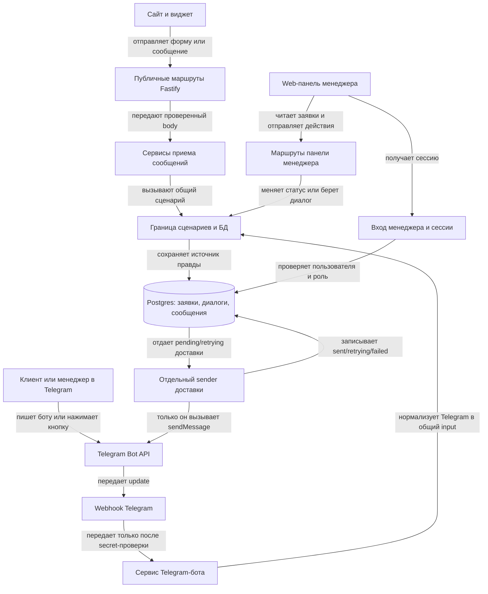
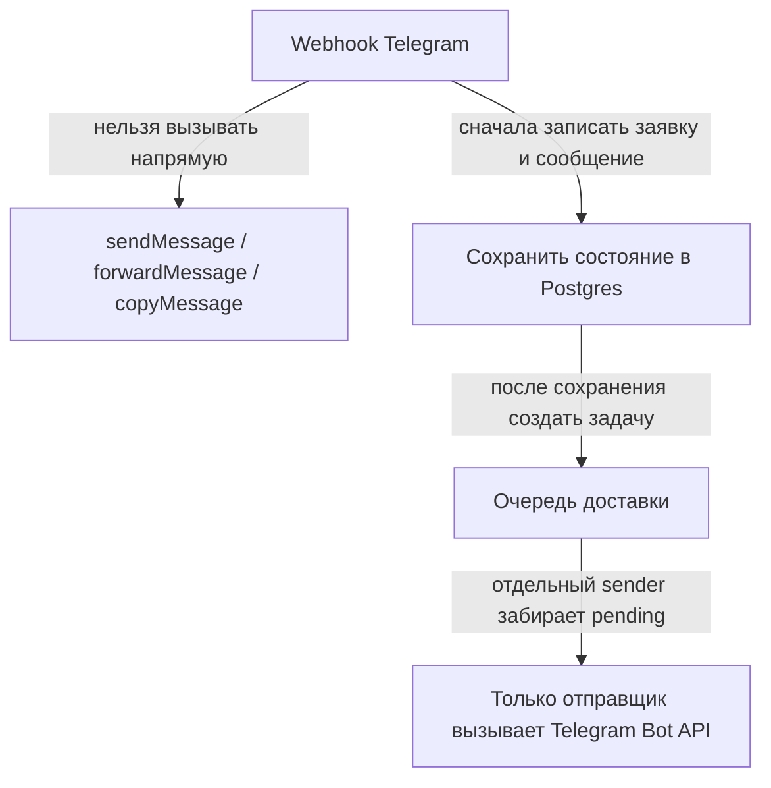
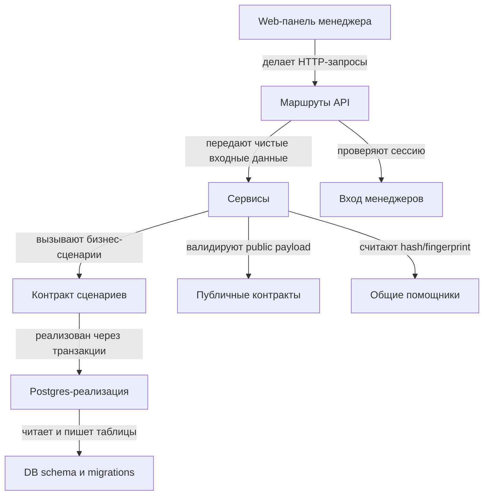
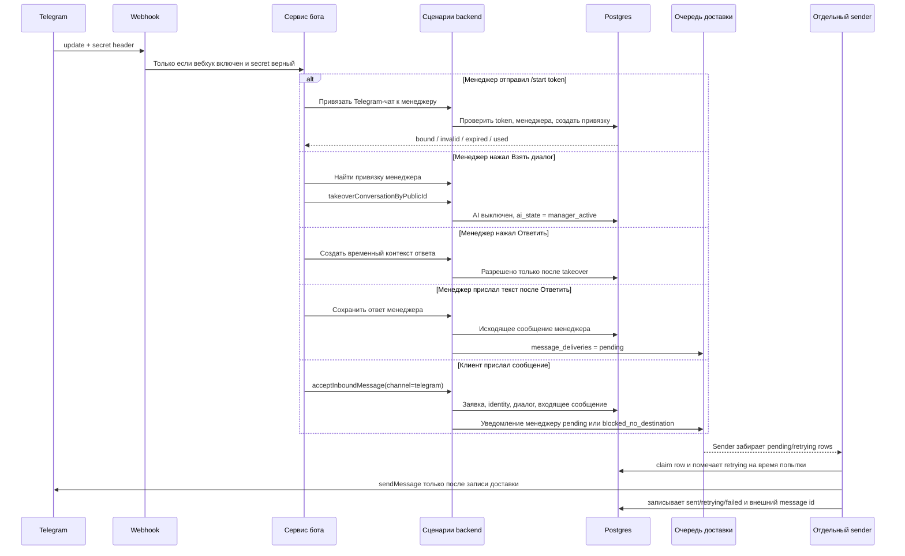
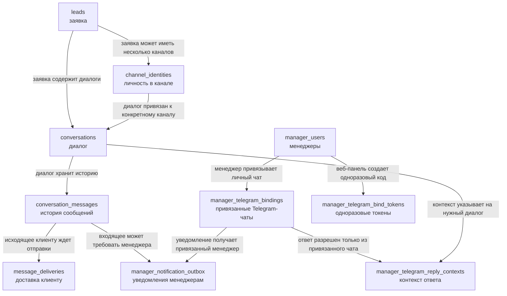
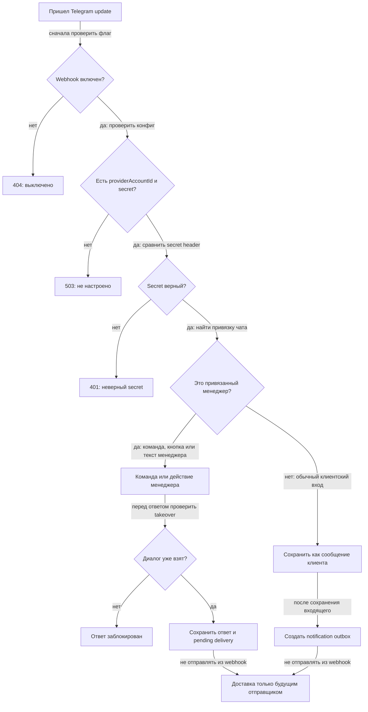

# Telegram и мини-панель менеджера: границы и состояние

Статус: снимок текущей архитектуры после локальной реализации, controlled staging smoke для manual sender/explicit worker и repo-level supervised scheduler templates. Это не разрешение на боевой запуск.
Дата: 2026-05-22
Репозиторий: `granit-operations`

Acceleration assumption от 2026-05-21: requester сообщил, что сейчас нет реальных клиентов и реальных менеджеров, которые зависят от Telegram path. Это снижает blast radius для controlled staging Bot API smoke с test bot/private chats и fake staging rows. Это не разрешает production, worker/scheduler, notification sender или Telegram AI outbound.

Документ объясняет, как сейчас устроены входящие сообщения Telegram, мини-панель менеджера, delivery sender path, explicit worker и supervised one-shot scheduler: где проходят границы, какие модули за что отвечают, что сохраняется в Postgres, что отправляет только отдельный sender/worker, а что все еще не разрешает боевой запуск.

Главная мысль: Telegram сейчас является входным каналом и интерфейсом для быстрых действий менеджера, но не отдельной CRM. Источник правды остается в `granit-operations`: заявки, диалоги, сообщения, takeover, очереди доставки и аудит.

## 1. Коротко

Что уже сделано:

- Добавлен `POST /telegram/webhook`, но он выключен по умолчанию.
- Webhook принимает события только при включенном `TELEGRAM_BOT_ENABLED`, настроенном `TELEGRAM_BOT_PROVIDER_ACCOUNT_ID` и правильном заголовке `x-telegram-bot-api-secret-token`.
- Сообщения клиентов из Telegram сохраняются через общий `acceptInboundMessage`.
- Менеджер может привязать личный Telegram-чат через кнопку в веб-панели и команду `/start <token>`.
- Привязка менеджера и manager actions принимаются только из private Telegram chats; group/supergroup updates игнорируются.
- Inline-кнопки `Взять диалог` и `Ответить` используют общий backend-контур: `publicConversationId`, takeover и временный контекст ответа.
- Текстовый ответ менеджера после takeover сохраняется как исходящее сообщение менеджера и создает `message_deliveries` со статусом `pending`.
- Уведомления менеджерам о входящих сообщениях Telegram создаются в `manager_notification_outbox`.
- Добавлен отдельный `TelegramMessageDeliveryService`, который забирает `message_deliveries.pending/retrying`, вызывает Telegram Bot API `sendMessage` и пишет `sent/retrying/failed/blocked_no_destination`.
- Добавлен explicit long-running worker `npm run deliver:telegram:worker`; он не стартует сам, использует тот же sender service и останавливается по `SIGTERM`/`SIGINT`.
- Controlled staging smoke подтвердил доставку одной fake manager-authored delivery через worker с записью внешнего Telegram `message_id`.
- `npm run deliver:telegram:once` теперь production-candidate one-shot: берет Postgres advisory lock, пишет structured logs и быстро выходит `0`, если lock занят.
- Telegram provider call имеет timeout и получает `AbortSignal`; timeout/cancel/network-unknown переводит delivery в `uncertain`, а не в auto-retry.
- `message_deliveries` поддерживает `processing` и `uncertain`; `uncertain` не забирается автоматическим claim.
- Добавлены repo templates для `systemd` service/timer и runbook stop/rollback.
- Панель менеджера получает delivery status для исходящих сообщений: статус, число попыток, последнюю ошибку и внешний message id после успешной отправки.

Что принципиально не сделано:

- Repo содержит supervised scheduler templates, но они не установлены и не включены как production service.
- Нет отдельного отправщика, который реально отправляет уведомления менеджерам из `manager_notification_outbox`.
- Исходящие AI-ответы в Telegram заблокированы через `TelegramOutboundBlockedError`.
- Боевой запуск заблокирован до G01-G17, backup/restore/rollback и явного подтверждения владельца.

Почему Telegram не отдельная CRM:

- Telegram хранит только данные канала: chat id, user id, username, update id, message id, file id.
- Бизнес-состояние находится в общих таблицах: `leads`, `channel_identities`, `conversations`, `conversation_messages`, `message_deliveries`, `manager_notification_outbox`.
- Веб-панель и Telegram-кнопки работают с одним `publicConversationId`.
- Telegram Bot API не решает статус заявки, не владеет takeover, не разрешает AI отвечать и не хранит каноническую историю.

Что дополнительно закрыто в safe-срезе sender-а:

- Drizzle schema отражает partial unique indexes из SQL migration для активных Telegram-привязок и единственного pending reply context.
- `manager_notification_outbox.manager_telegram_binding_id` в schema связан с `manager_telegram_bindings`.
- Текстовый Telegram-ответ от роли `viewer` блокируется даже если в состоянии остался старый reply context.

Основные ссылки:

- Код сборки API: [app.ts](../../apps/api/src/app.ts), [config.ts](../../apps/api/src/config.ts).
- Telegram route/service: [telegram.ts](../../apps/api/src/routes/telegram.ts), [telegram-bot-service.ts](../../apps/api/src/services/telegram-bot-service.ts).
- Delivery sender/worker: [telegram-delivery-service.ts](../../apps/api/src/services/telegram-delivery-service.ts), [telegram-delivery-worker.ts](../../apps/api/src/services/telegram-delivery-worker.ts), [telegram-delivery-repository.ts](../../apps/api/src/repositories/telegram-delivery-repository.ts), [deliver-telegram-pending-once.ts](../../apps/api/src/scripts/deliver-telegram-pending-once.ts), [deliver-telegram-worker.ts](../../apps/api/src/scripts/deliver-telegram-worker.ts), [postgres-advisory-lock.ts](../../apps/api/src/services/postgres-advisory-lock.ts).
- Supervised scheduler: [service](../../deploy/systemd/granit-telegram-delivery-once.service), [timer](../../deploy/systemd/granit-telegram-delivery-once.timer), [runbook](../runbooks/TELEGRAM_MANAGER_REPLY_SUPERVISED_SCHEDULER_RU.md).
- Общий контракт backend-сценариев: [intake-repository.ts](../../apps/api/src/repositories/intake-repository.ts).
- Postgres реализация: [postgres-intake-repository.ts](../../apps/api/src/repositories/postgres-intake-repository.ts).
- DB schema/migrations: [schema.ts](../../packages/db/src/schema.ts), [0006](../../packages/db/migrations/0006_p0_channel_neutral_conversation.sql), [0007](../../packages/db/migrations/0007_telegram_manager_mini_panel.sql), [0009](../../packages/db/migrations/0009_telegram_delivery_processing_uncertain.sql).
- Задача и доказательства проверки: [описание задачи](../tasks/TELEGRAM_INBOUND_MANAGER_MINI_PANEL_RU.md), [документ проверки](../release/evidence/TELEGRAM_INBOUND_MANAGER_MINI_PANEL_RU.md).

## 2. Общая Картина

Как читать схему:

- Сайт, виджет и Telegram не пишут в таблицы напрямую.
- Маршруты Fastify только принимают HTTP/webhook и передают работу дальше.
- `TelegramBotService` разбирает Telegram update, но не становится CRM.
- `Postgres` хранит операционную правду.
- Отдельный sender является единственным местом, где допустимы вызовы Telegram Bot API для доставки клиенту.

Запрещенная граница:

Webhook сейчас не вызывает `sendMessage`, `forwardMessage` или `copyMessage`.

## 3. Модули И Их Ответственность

| Модуль | За что отвечает | Что может знать | Что не должен делать | Ключевые файлы |
|---|---|---|---|---|
| `apps/api/src/routes` | Маршруты HTTP, вебхук, проверка входа, коды ответа | URL, headers, cookies, body, текущего менеджера | Писать напрямую в БД, вызывать методы отправки Telegram, решать AI-policy | [public-intake.ts](../../apps/api/src/routes/public-intake.ts), [telegram.ts](../../apps/api/src/routes/telegram.ts), [manager.ts](../../apps/api/src/routes/manager.ts), [manager-auth.ts](../../apps/api/src/routes/manager-auth.ts) |
| `apps/api/src/services` | Валидация публичных контрактов, нормализация Telegram update, запуск логики widget AI | Входные DTO, форму Telegram update, repository interface | Владеть schema, хранить бизнес-истину, отправлять Telegram-сообщения из вебхука | [public-widget-intake-service.ts](../../apps/api/src/services/public-widget-intake-service.ts), [telegram-bot-service.ts](../../apps/api/src/services/telegram-bot-service.ts), [widget-ai-service.ts](../../apps/api/src/services/widget-ai-service.ts) |
| `apps/api/src/repositories` | Переходы состояния и сохранение в БД | Транзакции, idempotency, таблицы, события таймлайна | Знать Fastify `request/reply`, cookies, Telegram/OpenAI clients | [intake-repository.ts](../../apps/api/src/repositories/intake-repository.ts), [postgres-intake-repository.ts](../../apps/api/src/repositories/postgres-intake-repository.ts) |
| `packages/db` | Таблицы, индексы, миграции, DB connection | Структуру Postgres | HTTP/UI/provider logic | [schema.ts](../../packages/db/src/schema.ts), [0006](../../packages/db/migrations/0006_p0_channel_neutral_conversation.sql), [0007](../../packages/db/migrations/0007_telegram_manager_mini_panel.sql), [0009](../../packages/db/migrations/0009_telegram_delivery_processing_uncertain.sql) |
| `apps/manager/src` | Панель менеджера: список заявок, карточка, статусы, takeover, token привязки Telegram | Форму ответов manager API и локальное UI state | Писать в БД напрямую, вызывать Telegram Bot API, хранить каноническое состояние | [App.tsx](../../apps/manager/src/App.tsx), [api.ts](../../apps/manager/src/api.ts), [types.ts](../../apps/manager/src/types.ts) |
| `packages/contracts` | Схемы public intake для сайта и виджета | Публичный request/response contract | Внутренности менеджера и Telegram | [index.ts](../../packages/contracts/src/index.ts) |
| `packages/shared` | Маленькие deterministic helpers | Хеши, стабильная сериализация | Бизнес-переходы или интеграции | [index.ts](../../packages/shared/src/index.ts) |

## 4. Поток Входящего Сообщения Telegram

Важные правила:

- `/start <token>` не создает заявку клиента. Это привязка менеджера.
- Если чат уже привязан как менеджерский, текст считается попыткой ответа менеджера, а не входящим клиентским сообщением.
- Клиентские сообщения всегда проходят через `acceptInboundMessage`.
- Текущее входящее сообщение клиента из Telegram переводит диалог в `needs_manager`, поэтому AI не отвечает клиенту в Telegram.
- Медиа (`voice`, `sticker`, `video_note`, `photo`, `document`) сохраняется как входящее сообщение с provider file ids и требует менеджера.
- `Ответить` до takeover блокируется.
- Ответ менеджера сохраняется, но не доставляется клиенту до появления отдельного отправщика.

## 5. Таблицы И Смысл Состояния

| Таблица | Зачем нужна | Кто пишет | Кто читает | Инварианты | Что защищает |
|---|---|---|---|---|---|
| `leads` | Карточка заявки: статус, контакт, источник, следующий шаг | Прием формы, входящие сообщения виджета/Telegram, действия менеджера | Панель менеджера, таймлайн, будущие очереди | Один общий контур для сайта, виджета и Telegram | Потерю заявок и разные CRM по каналам |
| `channel_identities` | Связь клиента с каналом: сессия виджета или Telegram chat/user | `acceptInboundMessage` | Диалоги, повторная обработка, модель чтения для менеджера | Telegram identity строится по provider/account/chat, не по бизнес-клиенту | Поддельные widget sessions для Telegram и дубли |
| `conversations` | Диалог и жесткий запрет AI-ответа после takeover | `acceptInboundMessage`, takeover, сохранение AI-ответа | Панель менеджера, контекст ответа, проверка перед AI send | `agent_allowed_to_reply` проверяется перед AI send; takeover выключает AI | AI-ответ после takeover |
| `conversation_messages` | Единая история входящих и исходящих сообщений | Виджет, Telegram, AI, ответ менеджера | Панель менеджера, доставка/очередь, повторная обработка | `idempotency_key` уникален; provider ids защищают от повторов вебхука | Дубли, потерю истории, неподтвержденное исходящее сообщение |
| `message_deliveries` | Состояние доставки клиенту | Ответ менеджера создает `pending`; sender обновляет `sent/retrying/failed/blocked_no_destination` | Sender, панель менеджера, таймлайн | Вызов Telegram API допустим только после записи доставки | Невидимые отправки и невозможность повтора |
| `manager_notification_outbox` | Очередь уведомлений менеджерам | Входящее сообщение Telegram после сохранения сообщения | Будущий notification sender, таймлайн, модель чтения | Нет привязанного менеджера -> `blocked_no_destination` | `forwardMessage`/`copyMessage` до сохранения и уведомления в неизвестный чат |
| `manager_telegram_bindings` | Привязка manager user к личному Telegram-чату | `/start <token>` | Поиск менеджера, destination для уведомлений, `/manager/me` | Активная привязка уникальна для manager/provider/chat | Подмену менеджера и отправку в чужой чат |
| `manager_telegram_bind_tokens` | Одноразовый token для привязки Telegram | Web panel route `/manager/me/telegram-bind-token` | `/start <token>` | Hash, 10 минут, single-use | Привязку без web login |
| `manager_telegram_reply_contexts` | Память "на какой диалог отвечает следующий текст менеджера" | Callback `Ответить` | Текстовый reply и `/cancel` | Только после takeover, expires через 10 минут, consumed after use | Ответ не тому клиенту или stale reply |

Вспомогательные таблицы:

- `widget_sessions` остается технической сущностью виджета сайта.
- `lead_timeline_events` хранит аудит: сообщение получено, takeover, уведомление создано/заблокировано, ответ менеджера поставлен в доставку.
- `manager_users` и `manager_sessions` отвечают за web-auth менеджеров.

## 6. Правила Безопасности

Правила:

- Manager actions разрешены только из привязанного Telegram-чата.
- Привязанный manager chat должен быть private; actor lookup сверяет chat id и Telegram user id.
- Webhook выключен по умолчанию.
- Secret обязателен.
- Ответ менеджера клиенту разрешен только после takeover.
- Исходящие AI-ответы в Telegram запрещены.
- Исходящее сообщение клиенту идет только через `message_deliveries`.
- Уведомления менеджерам идут только через `manager_notification_outbox`.
- Viewer не может выполнять takeover/reply callback.
- Идемпотентность обязательна для входящих сообщений клиентов и ответов менеджера.

## 7. Что Еще Блокирует Боевой Запуск

До боевого включения Telegram нужны:

- Supervised scheduler installation/smoke/sign-off; repo templates exist, but no production timer is approved by this document.
- Отправщик для `manager_notification_outbox`.
- Backup/restore/rollback proof.
- Закрытие G01-G17 из [23-production-ready-first-release.md](/home/devuser/ai-projects/granit-plan-app/ai-agent-stack-wiki/wiki/23-production-ready-first-release.md).
- Явное подтверждение владельца и ответственного за релиз.

Что нельзя считать готовым:

- Что ответ менеджера автоматически уходит клиенту в production.
- Что уведомления менеджерам уже уходят в Telegram.
- Что можно включать боевой Telegram webhook.
- Что можно включать исходящие AI-ответы в Telegram.
- Что `TELEGRAM_BOT_TOKEN` должен использоваться внутри webhook.

## 8. Как Быстро Читать Код

- Где подключаются маршруты: [app.ts](../../apps/api/src/app.ts).
- Где env flags Telegram: [config.ts](../../apps/api/src/config.ts), [ENVIRONMENT.md](../ENVIRONMENT.md).
- Где webhook проверяет enabled/configured/secret: [telegram.ts](../../apps/api/src/routes/telegram.ts).
- Где разбираются `/start`, callback-кнопки, входящие сообщения клиента и ответы менеджера: [telegram-bot-service.ts](../../apps/api/src/services/telegram-bot-service.ts).
- Где pending-доставки превращаются в Telegram Bot API payload: [telegram-delivery-service.ts](../../apps/api/src/services/telegram-delivery-service.ts), [telegram-delivery-repository.ts](../../apps/api/src/repositories/telegram-delivery-repository.ts).
- Где long-running loop: [telegram-delivery-worker.ts](../../apps/api/src/services/telegram-delivery-worker.ts), [deliver-telegram-worker.ts](../../apps/api/src/scripts/deliver-telegram-worker.ts).
- Ручной/supervised one-shot одного batch с Postgres advisory lock: `npm run deliver:telegram:once`.
- Explicit staged worker run без автодеплоя как service: `npm run deliver:telegram:worker`.
- Где systemd templates: [granit-telegram-delivery-once.service](../../deploy/systemd/granit-telegram-delivery-once.service), [granit-telegram-delivery-once.timer](../../deploy/systemd/granit-telegram-delivery-once.timer).
- Где описан общий контракт backend-сценариев: [intake-repository.ts](../../apps/api/src/repositories/intake-repository.ts).
- Где реально пишется Postgres-состояние: [postgres-intake-repository.ts](../../apps/api/src/repositories/postgres-intake-repository.ts).
- Где таблицы и миграции: [schema.ts](../../packages/db/src/schema.ts), [0006](../../packages/db/migrations/0006_p0_channel_neutral_conversation.sql), [0007](../../packages/db/migrations/0007_telegram_manager_mini_panel.sql), [0009](../../packages/db/migrations/0009_telegram_delivery_processing_uncertain.sql).
- Где UI менеджера показывает привязку Telegram, статус и диалоги: [App.tsx](../../apps/manager/src/App.tsx), [api.ts](../../apps/manager/src/api.ts), [types.ts](../../apps/manager/src/types.ts).
