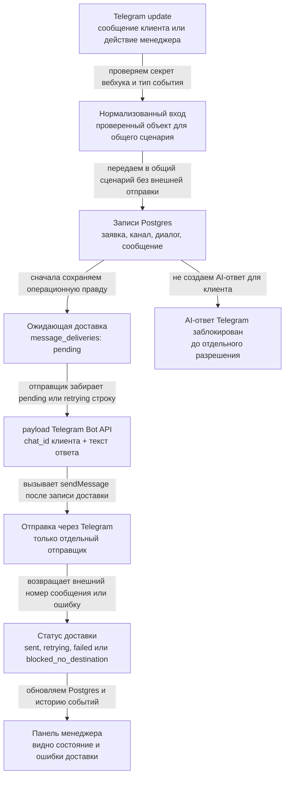
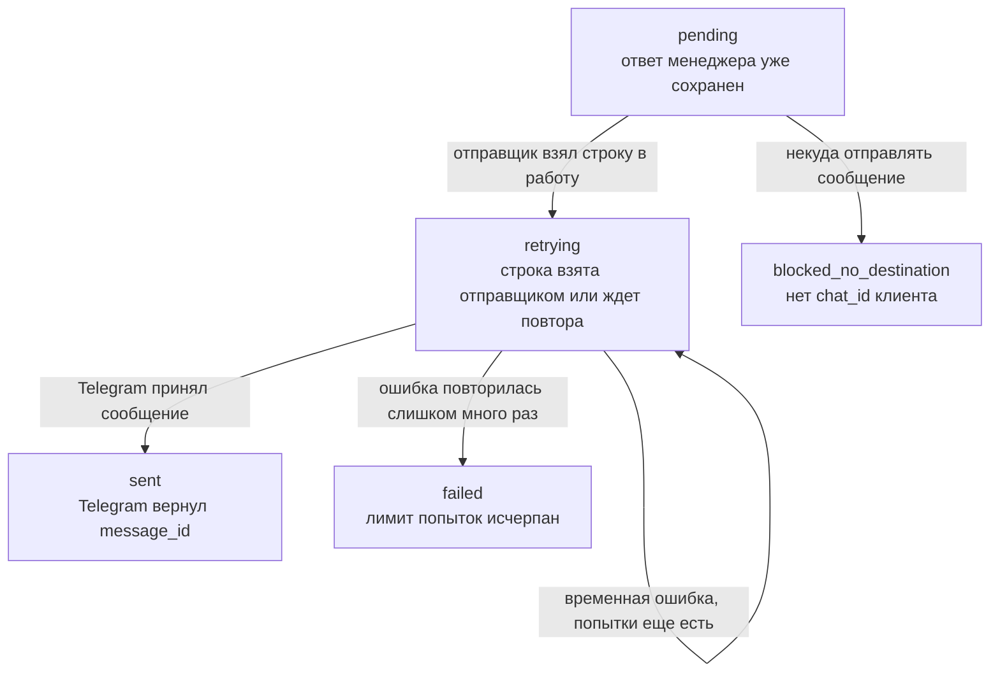

# Крупная схема Telegram-доставки

Источник правды: Postgres state в `granit-operations`.
Telegram здесь только транспорт: webhook нормализует входящие события, отдельный sender доставляет уже сохраненные ответы менеджера.



## Детализация доставки



## Участники и границы

| Участник | Что принимает | Что передает дальше | Что не делает |
|---|---|---|---|
| Telegram Bot API | update от клиента или менеджера | HTTP webhook `POST /telegram/webhook` | Не хранит бизнес-состояние заявки |
| Webhook route | raw Telegram update + secret header | `TelegramBotService.handleUpdate` | Не вызывает `sendMessage`, `forwardMessage`, `copyMessage` |
| TelegramBotService | Telegram message/callback | Общие use cases repository | Не пишет в БД напрямую и не отправляет клиенту |
| Postgres repository | Нормализованные команды | Таблицы `leads`, `channel_identities`, `conversations`, `conversation_messages`, `message_deliveries`, timeline | Не вызывает Telegram API |
| Delivery sender | `message_deliveries` со статусом `pending` или `retrying` | Telegram Bot API `sendMessage` payload | Не создает текст ответа и не решает AI policy |
| Manager UI | Manager read model | Показывает историю и delivery status | Не вызывает Telegram API |

## 1. Клиент пишет боту

Входящий payload от Telegram:

```json
{
  "update_id": 2301,
  "message": {
    "message_id": 801,
    "date": 1780000000,
    "chat": {
      "id": 88,
      "type": "private"
    },
    "from": {
      "id": 88,
      "first_name": "Иван",
      "username": "customer"
    },
    "text": "Нужен менеджер"
  }
}
```

Webhook сначала проверяет:

```text
TELEGRAM_BOT_ENABLED=true
TELEGRAM_BOT_PROVIDER_ACCOUNT_ID=bot-main
x-telegram-bot-api-secret-token == TELEGRAM_WEBHOOK_SECRET
```

Затем сервис превращает update в общий backend input:

```json
{
  "channel": "telegram",
  "provider": "telegram_bot",
  "providerAccountId": "bot-main",
  "externalChatId": "88",
  "externalUserId": "88",
  "providerMessageId": "801",
  "providerUpdateId": "2301",
  "displayName": "Иван",
  "username": "customer",
  "message": {
    "role": "visitor",
    "text": "Нужен менеджер",
    "contentType": "text",
    "submittedAt": "2026-05-21T17:00:00.000Z"
  },
  "automationRequested": false,
  "needsManagerReason": "telegram_human_requested",
  "idempotencyKey": "telegram:bot-main:88:801"
}
```

Что сохраняется:

| Таблица | Ключевые поля | Зачем |
|---|---|---|
| `leads` | `source_channel='telegram'`, контакт из Telegram profile | Общая заявка, не Telegram CRM |
| `channel_identities` | `provider_account_id='bot-main'`, `external_chat_id='88'`, `external_user_id='88'` | Destination клиента для будущей доставки |
| `conversations` | `channel='telegram'`, `ai_state='needs_manager'`, `agent_allowed_to_reply=false` | Диалог требует менеджера, AI не отвечает |
| `conversation_messages` | inbound message, `provider_message_id='801'`, `provider_update_id='2301'` | История и идемпотентность |
| `manager_notification_outbox` | `pending` или `blocked_no_destination` | Уведомление менеджеру, отдельный sender еще вне этого среза |
| `lead_timeline_events` | `conversation.message_received`, `manager.notification_enqueued` | Аудит |

## 2. Менеджер нажимает кнопку

Callback для взятия диалога:

```json
{
  "update_id": 2302,
  "callback_query": {
    "id": "callback-1",
    "from": {
      "id": 9001,
      "username": "owner_manager"
    },
    "message": {
      "chat": {
        "id": 9001,
        "type": "private"
      }
    },
    "data": "takeover:PUBLIC_CONVERSATION_ID"
  }
}
```

Что проверяется:

| Проверка | Источник |
|---|---|
| Chat менеджера привязан | `manager_telegram_bindings` |
| Роль не `viewer` | `manager_users.role` |
| Диалог существует | `conversations.public_conversation_id` |

Что меняется:

```json
{
  "conversations.agent_allowed_to_reply": false,
  "conversations.ai_state": "manager_active",
  "lead_timeline_events.event_type": "conversation.manager_takeover"
}
```

Callback для ответа:

```json
{
  "data": "reply:PUBLIC_CONVERSATION_ID"
}
```

Он создает короткоживущий context:

```json
{
  "manager_user_id": "MANAGER_ID",
  "manager_telegram_binding_id": "BINDING_ID",
  "lead_id": "LEAD_ID",
  "conversation_id": "CONVERSATION_ID",
  "public_conversation_id": "PUBLIC_CONVERSATION_ID",
  "status": "pending",
  "expires_at": "now + 10 minutes"
}
```

## 3. Менеджер пишет текст ответа

Входящий Telegram message от привязанного менеджера:

```json
{
  "update_id": 2304,
  "message": {
    "message_id": 802,
    "chat": {
      "id": 9001,
      "type": "private"
    },
    "from": {
      "id": 9001,
      "username": "owner_manager"
    },
    "text": "Здравствуйте. Уточню детали заказа."
  }
}
```

Backend не отправляет его клиенту из webhook. Он сначала сохраняет outbound message:

```json
{
  "conversation_messages.direction": "outbound",
  "conversation_messages.sender_role": "manager",
  "conversation_messages.body": "Здравствуйте. Уточню детали заказа.",
  "conversation_messages.channel_identity_id": "CUSTOMER_TELEGRAM_IDENTITY_ID",
  "conversation_messages.idempotency_key": "telegram-manager-reply:bot-main:9001:802"
}
```

И создает доставку:

```json
{
  "message_deliveries.conversation_message_id": "OUTBOUND_MESSAGE_ID",
  "message_deliveries.channel": "telegram",
  "message_deliveries.provider": "telegram_bot",
  "message_deliveries.status": "pending",
  "message_deliveries.attempt_count": 0,
  "message_deliveries.last_error": null,
  "message_deliveries.provider_message_id": null
}
```

Timeline:

```json
{
  "event_type": "conversation.manager_message_queued",
  "summary": "Manager Telegram reply queued for delivery",
  "metadata": {
    "public_conversation_id": "PUBLIC_CONVERSATION_ID",
    "public_message_id": "PUBLIC_MESSAGE_ID",
    "channel": "telegram",
    "delivery_status": "pending",
    "changed_by_manager_id": "MANAGER_ID"
  }
}
```

## 4. Sender забирает delivery row

Отдельный sender запускается вручную локально:

```bash
npm run deliver:telegram:once
```

Repository выбирает строки:

```sql
SELECT ...
FROM message_deliveries
JOIN conversation_messages ON ...
JOIN conversations ON ...
JOIN channel_identities ON ...
WHERE message_deliveries.channel = 'telegram'
  AND message_deliveries.provider = 'telegram_bot'
  AND message_deliveries.status IN ('pending', 'retrying')
  AND conversation_messages.direction = 'outbound'
  AND channel_identities.channel = 'telegram'
  AND channel_identities.provider_account_id = 'bot-main'
ORDER BY message_deliveries.updated_at, message_deliveries.created_at
LIMIT 10
FOR UPDATE OF message_deliveries SKIP LOCKED;
```

На время попытки строка помечается как `retrying`, чтобы параллельный sender не взял ту же доставку.

Claimed row внутри приложения выглядит так:

```json
{
  "deliveryId": "DELIVERY_ID",
  "leadId": "LEAD_ID",
  "conversationMessageId": "OUTBOUND_MESSAGE_ID",
  "publicConversationId": "PUBLIC_CONVERSATION_ID",
  "publicMessageId": "PUBLIC_MESSAGE_ID",
  "body": "Здравствуйте. Уточню детали заказа.",
  "providerAccountId": "bot-main",
  "externalChatId": "88",
  "attemptCount": 0
}
```

## 5. Payload в Telegram Bot API

Sender строит payload только из Postgres:

| Поле Telegram API | Откуда берется |
|---|---|
| `chat_id` | `channel_identities.external_chat_id` клиента |
| `text` | `conversation_messages.body` сохраненного ответа менеджера |

Фактический request:

```http
POST https://api.telegram.org/bot<TELEGRAM_BOT_TOKEN>/sendMessage
content-type: application/json
```

```json
{
  "chat_id": "88",
  "text": "Здравствуйте. Уточню детали заказа."
}
```

Важно: `TELEGRAM_BOT_TOKEN` нужен только sender-у. Webhook не использует token для бизнес-отправок.

## 6. Успешная доставка

Ответ Telegram:

```json
{
  "ok": true,
  "result": {
    "message_id": 1001
  }
}
```

Что записывает repository:

```json
{
  "message_deliveries.status": "sent",
  "message_deliveries.attempt_count": 1,
  "message_deliveries.last_error": null,
  "message_deliveries.provider_message_id": "1001",
  "conversation_messages.provider_message_id": "1001",
  "conversation_messages.provider_sent_at": "2026-05-21T17:01:00.000Z",
  "lead_timeline_events.event_type": "conversation.delivery_sent"
}
```

Manager UI видит:

```json
{
  "publicMessageId": "PUBLIC_MESSAGE_ID",
  "direction": "outbound",
  "senderRole": "manager",
  "body": "Здравствуйте. Уточню детали заказа.",
  "delivery": {
    "status": "sent",
    "attemptCount": 1,
    "providerMessageId": "1001",
    "updatedAt": "2026-05-21T17:01:00.000Z"
  }
}
```

## 7. Ошибка доставки

Retryable ошибка, например 429 или 5xx:

```json
{
  "ok": false,
  "description": "Too Many Requests"
}
```

Если попытки еще есть:

```json
{
  "message_deliveries.status": "retrying",
  "message_deliveries.attempt_count": 2,
  "message_deliveries.last_error": "Too Many Requests",
  "lead_timeline_events.event_type": "conversation.delivery_retrying"
}
```

Если лимит попыток исчерпан:

```json
{
  "message_deliveries.status": "failed",
  "message_deliveries.attempt_count": 3,
  "message_deliveries.last_error": "Bad Gateway",
  "lead_timeline_events.event_type": "conversation.delivery_failed"
}
```

Если нет `external_chat_id` клиента:

```json
{
  "message_deliveries.status": "blocked_no_destination",
  "message_deliveries.attempt_count": 0,
  "message_deliveries.last_error": "telegram customer chat id is missing",
  "lead_timeline_events.event_type": "conversation.delivery_blocked"
}
```

В этом случае provider call не выполняется.

## 8. Что намеренно не включено

- Telegram AI outbound не включен.
- Webhook не отправляет `sendMessage`, `forwardMessage`, `copyMessage`.
- Notification sender для `manager_notification_outbox` отдельно не реализован в этом срезе.
- Автозапущенный production worker/scheduler не добавлен.
- Production/deploy/secrets changes не делались.
